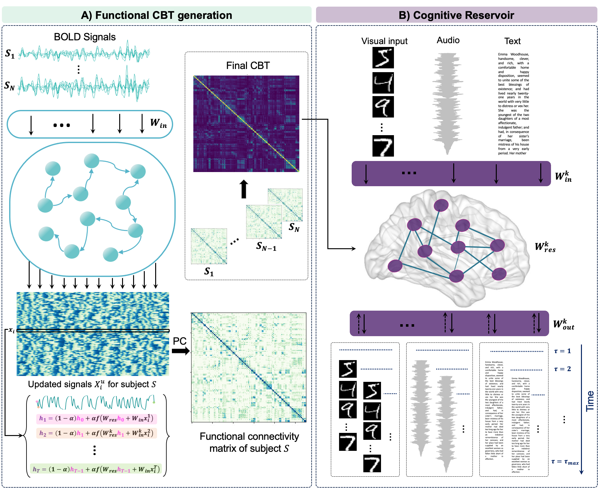

# mCOCO: Multi-Sensory Cognitive Computing for Learning Population-level Brain Connectivity
We developed a novel framework called mCOCO which generates cognitively enhanced Connectional Brain Templates (CBTs) from a set of BOLD signals using a brain-inspired approach - Reservoir Computing-.

Please contact mayssa.soussia@gmail.com for inquiries. Thanks.




# Introduction
This work  has been accepted in main MICCAI 2025, Daejon, South Korea. 


> **Multi-Sensory Cognitive Computing for Learning Population-level Brain Connectivity**
>
> Mayssa Soussia, Mohamed Ali Mahjoub and Islem Rekik
>
> LATIS Lab, National Engineering School of Sousse, University of Sousse, Tunisia
> 
> BASIRA Lab, Imperial-X and Department of Computing, Imperial College London, London, UK
>
> **Abstract:** *The generation of connectional brain templates (CBTs) has recently garnered significant attention for its potential to identify unique connectivity patterns shared across individuals. However, existing methods for CBT learn- ing such as conventional machine learning and graph neural networks (GNNs) are hindered by several limitations. These include: (i) poor interpretability due to their black-box nature, (ii) high computational cost, and iii) an exclusive fo- cus on structure and topology, overlooking the cognitive capacity of the gener- ated CBT. To address these challenges, we introduce mCOCO (multi-sensory COgnitive COmputing), a novel framework that leverages Reservoir Comput- ing (RC) to learn population-level functional CBT from BOLD (Blood-Oxygen- level-Dependent) signals. RC’s dynamic system properties allow for tracking state changes over time, enhancing interpretability and enabling the modeling of brain-like dynamics, as demonstrated in prior literature. By integrating multi- sensory inputs (e.g., text, audio, and visual data), mCOCO captures not only structure and topology but also how brain regions process information and adapt to cognitive tasks such as sensory processing, all in a computationally efficient manner. Our mCOCO framework consists of two phases: (1) mapping BOLD sig- nals into the reservoir to derive individual functional connectomes, which are then aggregated into a group-level CBT—an approach, to the best of our knowledge, not previously explored in functional connectivity studies —and (2) incorporat- ing multi-sensory inputs through a cognitive reservoir, endowing the CBT with cognitive traits. Extensive evaluations show that our mCOCO-based template sig- nificantly outperforms GNN-based CBT in terms of centeredness, discriminative- ness, topological soundness, and multi-sensory memory retention.*

## Key Contributions

- **Cognitive Templates**: CBTs are no longer static structural averages; they're endowed with memory and dynamic behavior.
- **Reservoir Computing**: Models temporal dynamics efficiently, with better interpretability and lower computational cost.
- **Multi-Sensory Inputs**: Evaluates CBTs using sensory streams (MNIST, speech, language) to assess short-term memory capacity.
- **Population-Level Learning**: Builds a group-level CBT template from ASD subjects using cross-validation.


## Dataset Description

The dataset provided in this repository is a portion of the full dataset used in our study. It consists of preprocessed functional data from:

- **73 individuals** with Autism Spectrum Disorder (ASD)
- **77 typically developing (TD)** controls
  
To access the complete dataset, please refer to the ABIDE (Autism Brain Imaging Data Exchange) repository at: [https://fcon_1000.projects.nitrc.org/indi/abide/](https://fcon_1000.projects.nitrc.org/indi/abide/)


## Project Structure

### 1. CBT Generation with Reservoir Computing

- **File**: `cbt_generation.py`
- **Goal**: Generate population-level CBTs using RC

### 2. Multi-Sensory Memory Capacity Evaluation

- **File**: `multi_sensory_memory_capacity.py`
- **Goal**: Validate the memory/cognitive capacity of CBTs using multi-sensory streams (visual, audio, language).

#### Sensory inputs: 
- **Visual**: we used MNIST dataset to meansure the visual memory capacity of the cognitive reservoir.
- **Audio**: We used two types of audio streams: a Beethoven soundtracck amd a quranic recitation to measure the auditory memory of the cognitive reservoir. 
- **Language**: We used Gutenberg embeddings to measure the linguistic memory capacity of the cognitive reservoir. 

## Installation

Ensure you have Python 3.x installed. To install the required dependencies, use

```bash
pip install -r requirements.txt
```


## Run the Pipeline

### 1. CBT Generation
```bash
python cbt_generation.py
```
### 1. CBT Generation
```bash
python multi_sensory_memory_capacity.py
```


## Citation 
if you use this work, please cite:
```bibtex

@inproceedings{soussia2025multi,
  title={Multi-Sensory Cognitive Computing for Learning Population-level Brain Connectivity
Abstract},
  author={Soussia, Mayssa and Mahjoub, Mohamed Ali and Rekik, Islem},
  booktitle={Medical Image Computing and Computer Assisted Intervention--MICCAI 2025: 28th International Conference, Daejon, Korea, September 23--28, 2025},
  pages={},
  year={2025},
  organization={Springer}
}


